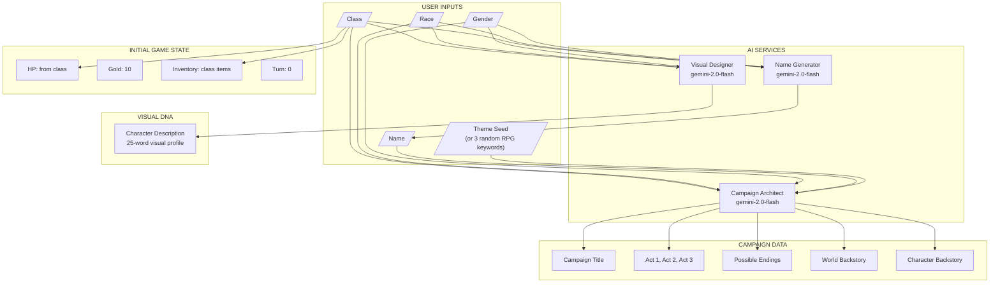
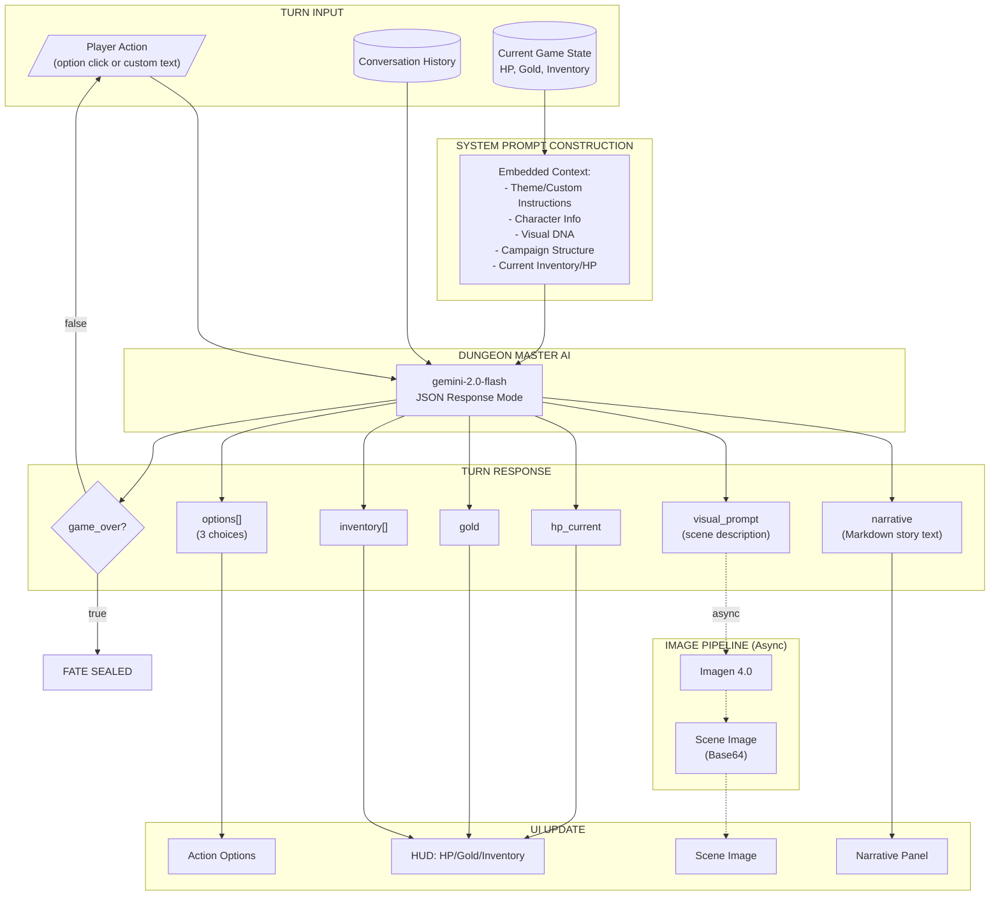

# GemRPG

An AI-powered text-based RPG that generates dynamic fantasy adventures using Google's Gemini AI. Create unique characters, explore procedurally generated worlds, and experience stories that adapt to your choices.

## Features

- **AI-Generated Campaigns**: Complete 3-act story structures with world and character backstories
- **Dynamic Narrative**: Every turn generates unique story content based on your actions
- **AI Scene Images**: Real-time image generation using Imagen 4.0
- **Character Creation**: 12 classes, 9 races, and custom theme seeds
- **Visual DNA**: Persistent character appearance across all generated imagery

---

## AI Architecture

GemRPG uses multiple AI services orchestrated together to create immersive gameplay. The system is built around two main phases: **Character Creation** and the **Turn Loop**.

### AI Services Overview

| Service | Model | Purpose |
|---------|-------|---------|
| **Name Generator** | `gemini-2.0-flash` | Generates fantasy names based on gender/race/class |
| **Campaign Architect** | `gemini-2.0-flash` | Creates 3-act story structure, backstories, and possible endings |
| **Visual Designer** | `gemini-2.0-flash` | Generates 25-word character visual description (Visual DNA) |
| **Dungeon Master** | `gemini-2.0-flash` | Per-turn narrative, game state updates, and visual prompts |
| **Image Generator** | `imagen-4.0-generate-001` | Async scene image generation from visual prompts |

---

### Character Creation Flow

When a player creates a character, three AI services work in parallel to build the game world:



**Key Files:**
- [`client/src/lib/game-engine.ts`](client/src/lib/game-engine.ts) - AI API implementations
- [`client/src/components/game/CreationScreen.tsx`](client/src/components/game/CreationScreen.tsx) - Creation flow orchestration
- [`client/src/lib/game-constants.ts`](client/src/lib/game-constants.ts) - Classes, races, RPG keywords

---

### Turn Loop Flow

Each turn, the player's action is processed by the Dungeon Master AI, which returns narrative and game state updates. Image generation runs asynchronously to avoid blocking gameplay.



**Key Files:**
- [`client/src/components/game/GameScreen.tsx`](client/src/components/game/GameScreen.tsx) - Turn loop implementation
- [`client/src/lib/game-engine.ts`](client/src/lib/game-engine.ts) - `API.chat()` and `API.generateImage()`

---

### Data Flow Summary

| Data Element | Source | Used By |
|--------------|--------|---------|
| **World Backstory** | Campaign Architect AI | Lore Modal, System Prompt |
| **Character Backstory** | Campaign Architect AI | Lore Modal, System Prompt |
| **Visual DNA** | Visual Designer AI | Every turn's System Prompt for image consistency |
| **Inventory** | Class defaults → AI updates | HUD, System Prompt, Narrative decisions |
| **HP/Gold** | Class defaults → AI updates | HUD, Game Over detection |
| **Theme Seeds** | User input or 3 random RPG keywords | Campaign generation, narrative tone |

---

### Cascading Effects

Understanding how changes propagate through the system:

| When This Changes | Downstream Effects |
|-------------------|-------------------|
| `class` | Starting HP, starting items, name generation context, campaign themes |
| `customPrompt` (theme seed) | Entire campaign direction, world/character backstories |
| `TurnResponse.hp_current` | HUD update, if ≤0 triggers game over |
| `TurnResponse.visual_prompt` | Triggers async Imagen 4.0 call, updates scene display |
| `TurnResponse.inventory` | Bag modal contents, embedded in future turn prompts |
| `CampaignData.possible_endings` | Guides AI toward narrative closure in every turn |

---

## Tech Stack

- **Frontend**: React + TypeScript + Vite + Tailwind CSS
- **Backend**: Express.js + Drizzle ORM + PostgreSQL
- **AI**: Google Gemini 2.0 Flash + Imagen 4.0
- **Auth**: Replit OpenID Connect

## Environment Variables

```bash
GEMINI_API_KEY=    # Google AI API key
DATABASE_URL=           # PostgreSQL connection string
SESSION_SECRET=         # Session encryption key
```

## Getting Started

```bash
pnpm install
pnpm dev
```

---

## License

MIT

